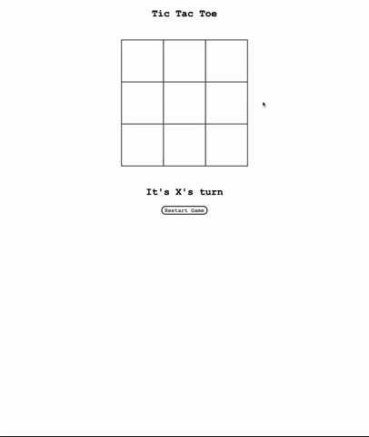

# Tic-Tac-Toe | 

## Description
This is a simple Tic-Tac-Toe board using *Vanilla JavaScript*, HTML, and CSS. 

## Table of Contents

* [Usage](#usage)
* [Installation](#installation)
* [Credits](#credits)
* [License](#license)

## Usage

*Below is a GIF demonstrating the usage of the application*

*Below is a link to the deployed application.*

*https://lambaa94.github.io/Tic-Tac-Toe/*

## Installation

npm start

## Credits

Tutorial used is by **Borna Šepić**

*https://dev.to/bornasepic/pure-and-simple-tic-tac-toe-with-javascript-4pgn*

## License

This repo is under the MIT License

## Questions

If you have any questions please email me at jameslamb13@gmail.com. My link to GitHub is https://github.com/Lambaa94
